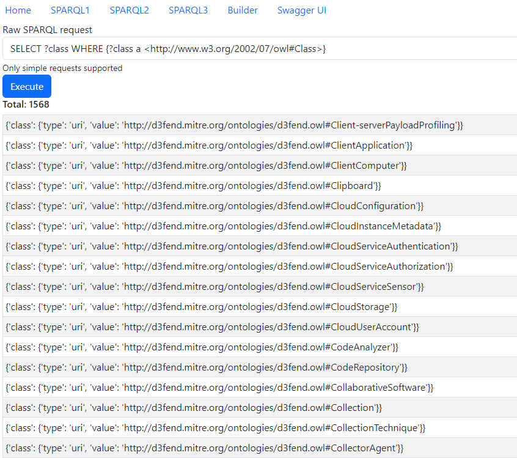

# PT-TestTask

Тестовое приложение оформлено в виде пакета app. Для подключения к базе данных используется достаточно старый пакет pymantic, который пришлось немного доработать, т.к. он был написан на сильно старую версию Python, поэтому его код также приложен.

База разворачивается без каких-либо проблем локально и данные в нее загружаются через штатный механизм. База не приложена, т.к. github не позволяет добавлять файлы больше 50Мб.

Предварительно заданные SPARQL-запросы описаны в configuration файле, выборка идет универсально. Дополнгительно сделана еще одна страница с возможностью ввода SPARQL запроса вручную и его выполнением.
Интерфейс построен на Bootstrap, простенький, без изысков.

REST API наиболее просто проверить используя VSCode плагин REST Client, два тестовых запроса написаны в файле rawsparql.http